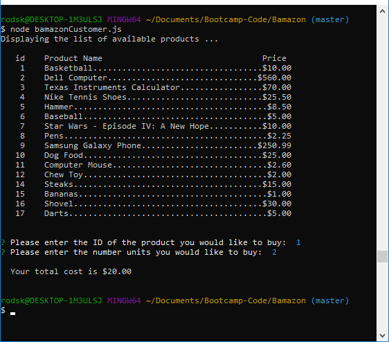
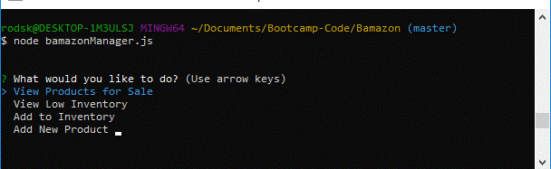
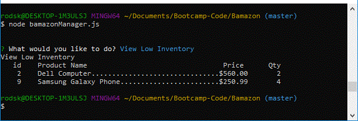
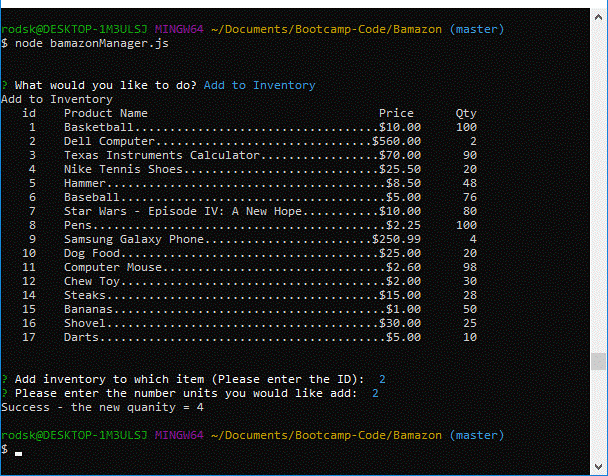
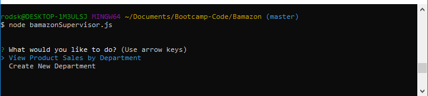
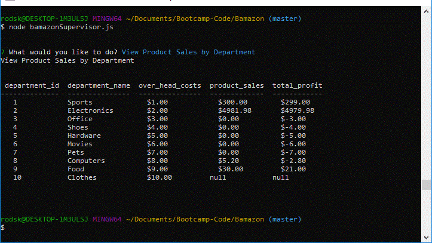
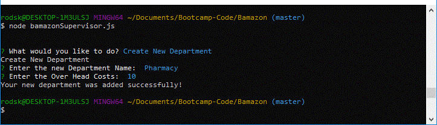
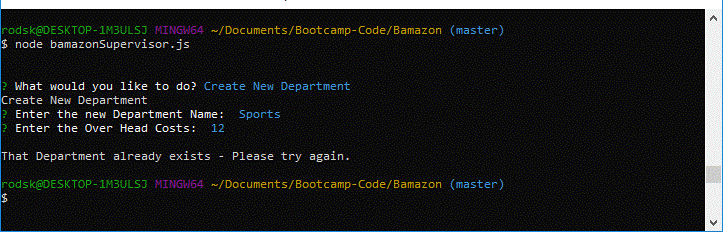

# **Bamazon**
### Amazon-like storefront utilizing MySQL and Node.js
### Author: Rod Skoglund
### Date: August 3, 2018
----------------

# **Table Of Contents**
1. Application Introduction
2. Instructions
3. Minimum Requirements
4. Example Results
----------------

## **1. Application Introduction**
This application uses node.js and mySQL to provide an Amazon-Like application.

The application responds to commands from three different roles - the customer, manager and supervisor. Each has different actions they can take to miniplate the data. The underlying data is stored and maintained in a mySQL database.

----------------
## **2. Instructions**
There are three different interfaces for the three different roles that can use this application to minipulate the available products. The three roles, along with their applicable interface command is as follows:

### **A. Customer**
#### A.1. Command Line:
* node bamazonCustomer.js

#### A.2. Available Commands:

* **Purchase product(s)** \
Upon running this application, the first thing to happen is that it will display all of the items available for sale. It will include the id, name, and price of all the products for sale.\
\
The app will then prompt users with two messages.

   * The first asks them to enter the ID of the product they would like to buy.
   * The second message asks them to enter the number of units of the product they would like to buy. 

   Once the customer has placed the order, the application will check if there is enough inventory of the product to meet the customer's request.

   If not, the app will log the phrase `Insufficient quantity!`, and then prevent the order from going through. \
    \
    If there is enough inventory of the product, the application will fulfill the customer's order. It will decrease the inventory for that product by the amount purchased by te customer (update data in the mySQL DB)
    
    Once the update goes through, the application will show the customer the total cost of their purchase. \
    \
    If the customer wants to cancel the order, they can pick any product and select `0` for the quanity. 

### **B. Manager**
#### B.1. Command Line: 
* node bamazonManager.js

#### B.2. Available Commands:
* **View Products for Sale** \
If a manager selects `View Products for Sale`, this app will list every available item. The display will include the item ID, name, price, and quantity for each available product.
    
* **View Low Inventory** \
If a manager selects `View Low Inventory`, the application will list all items with an inventory count lower than five.

* **Add to Inventory** \
If a manager selects `Add to Inventory`, the application will display a prompt that will let the manager "add more" of any item currently in the store.
    
* **Add New Product** \
If a manager selects `Add New Product`, the pplication will allow the manager to add a completely new product to the store.

### **C. Supervisor**
#### C.1. Command Line: 
* node bamazonSupervisor.js

#### A.2. Available Commands:

* **View Product Sales by Department** \
When a supervisor selects `View Product Sales by Department`, the application will display a summarized table. The table will include the Department ID, Name, Over Head Costs, Product Sales and Total Profit. \
\
The `total_profit` column is calculated on the fly using the difference between `over_head_costs` and `product_sales`. 

* **Create New Department** \
If a supervisor selects `Add New Department`, the pplication will allow the supervisor to add a completely new department to the store.

----------------
## **3. Minimum Requirements**
In order to run this application, you will need the following utilities and packages:
 * node.js
 * The following npm packages:
    * "console.table": "^0.10.0",
    * "inquirer": "^6.0.0"

----------------
## **4. Example Results**
    ###A Customer Interaction example:
        

    ###The Manager Menu:
        

    ###The Manager - View Products:
        

    ###The Manager - View Low Inventory:
        

    ###The Manager - Add Inventory:
        

    ###The Manager - Add New Product:
        
    
    ###The Supervisor Menu:
        

    ###The Supervisor - View Product Sales by Department:
        

    ###The Supervisor - Create New Department:
        

    ###The Supervisor - Create New Department - Duplicate:
        

Enjoy :smiley: 